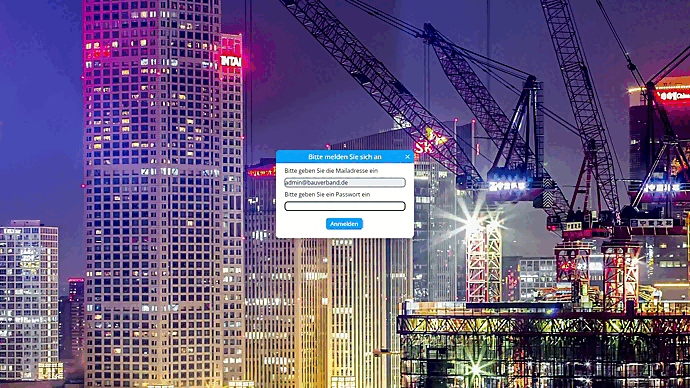

# Handbuch
Auf dieser Seite werden verschiedene Funktionen des Dashboards per Video vorgeführt und beschrieben. Funktionen des Dashboards stehen nur dann zur Verfügung, wenn man sich im System [angemeldet hat](https://dashboard-dokumentation.readthedocs.io/en/latest/handbuch/#login-logout). Ist man nicht angemeldet, hat man die Möglichkeit die verschiedenen [Dashboard-Seiten](https://dashboard-dokumentation.readthedocs.io/en/latest/handbuch/#dashboard-seite) zu betrachten.

## Basics
In diesem Abschnitt werden die An- und Abmelde-Abläufe, sowie die Seitenverwaltung vorgestellt.

### Login & Logout   
Um sich auf einer Seite anzumelden, muss der Nutzer zuvor von einem Administrator hinterlegt worden sein. Ist der Nutzer bereits im System hinterlegt, kann er sich mit seiner E-Mail-Adresse und dem dazugehörigen Passwort anmelden. Ist er angemeldet, hat er Zugang zu den verschiedenen Funktionen als Administrator. Hierzu gehören beispielsweise das Erstellen neuer Dashboard-Seiten, Anpassen der Prognosen oder Verwalten von Nutzern.
Möchte sich der Nutzer wieder abmelden, so findet er rechts oben den Logout-Button. Ist der Nutzer abgemeldet, so hat er nur noch Zugang zur öffentlichen Seite des Dashboards, welche verschiedene Dashboard-Seiten mit den dazugehörigen Kacheln visualisiert.

   

 

### Seitenverwaltung
In der Sidebar hat der Nutzer die Möglichkeit neue Seiten zu erstellen, indem er das Element "Seite hinzufügen" klickt. Möchte man eine Seite umbenennen, so kann man das Stift-Symbol anklicken und sie im „Seite bearbeiten“-Dialog umbenennen. Indem man auf das Mülleimer Symbol klickt, kann man eine Seite vollständig löschen. 

 

## Dashboard-Seite 
### Dashboard-Seite Basic  
Auf dieser Seite kann der Nutzer zwischen den verschiedenen Dashboard-Seiten wählen.

 

 

## Admin-Seite
Auf der Admin-Seite hat man die Möglichkeit Kacheln zu erstellen, zu bearbeiten oder zu löschen. Möchte man eine neue Kachel erstellen, so kann man im ersten Schritt einen Titel wählen und festlegen, ob es sich um Monats-, Quartals- oder Jahresdaten handelt. Im zweiten Schritt kann der Nutzer entscheiden, ob ein Freitext, Kennzahl, oder Diagramm erstellt werden soll:

### Freitext erstellen
Entscheidet sich der Nutzer für einen Freitext, so kann er den Text im dritten Schritt eingeben. Die Kachel wird anschließend erstellt und der Dialog schließt sich.  
 

 

### Kennzahl erstellen
Entscheidet sich der Nutzer für eine Kennzahl, so kann er im dritten Schritt wählen, welche Art von Kennzahl erstellt werden soll:  

- Mittelwert   
- Median   
- Summe  
- Höchstwert  
- Tiefstwert 

Im vierten Schritt kann der Nutzer die Datenreihe auswählen und eine Kurzbeschreibung hinzufügen. Optional kann er das Start- und End-Datum für die ausgewählte Datenreihe verändern. Des Weiteren ist es möglich, eine Prognose hinzuzufügen. Hierfür muss allerdings das Datum im Bis-Filter in der Zukunft liegen. Es ist möglich über den "Datenreihe hinzufügen" Button eine weitere Datenreihe zur Kachel hinzuzufügen. Ein optionales Textfeld kann im fünften Schritt hinzugefügt werden.

 

 

### Diagramm erstellen
Entscheidet sich der Nutzer für ein Diagramm, so kann er im dritten Schritt wählen, welche Art von Diagramm erstellt werden soll:  

- Liniendiagramm   
- Balkendiagramm
- Flächendiagramm  
- Scatterplot

Im vierten Schritt kann der Nutzer die Datenreihe auswählen und eine Kurzbeschreibung hinzufügen. Optional kann er noch das Start- und End-Datum für die ausgewählte Datenreihe verändern. Des Weiteren ist es möglich, eine Prognose hinzuzufügen. Hierfür muss allerdings das Datum im Bis-Filter in der Zukunft liegen. Es ist möglich über den "Datenreihe hinzufügen" Button eine weitere Datenreihe zur Kachel hinzuzufügen. Im fünften Schritt wird die Achsenbeschriftung hinzugefügt und es ist möglich einen Text hinzuzufügen.

 

 

### Kachel verwalten
Um eine bestimmte Kachel zu bearbeiten, kann der Nutzer über den Button "Bearbeiten" den Bearbeitungsdialog öffnen. Über den Button "Entfernen" hat der Nutzer die Möglichkeit, eine bestimmte Kachel zu löschen.

 

## Prognose-Seite
Diese Seite bietet dem Nutzer ein Überblick zur bestehenden Prognose einer ausgewählten Datenreihe. Des Weiteren können hier die dazugehörigen Parameter eingesehen und bei Bedarf angepasst werden.

### Prognose-Seite Basic

 

### Prognose manuell anpassen
  

 

## User Administration-Seite 
Auf dieser Seite werden die verschiedenen Nutzer verwaltet. Nutzer können hinzugefügt oder gelöscht werden.

