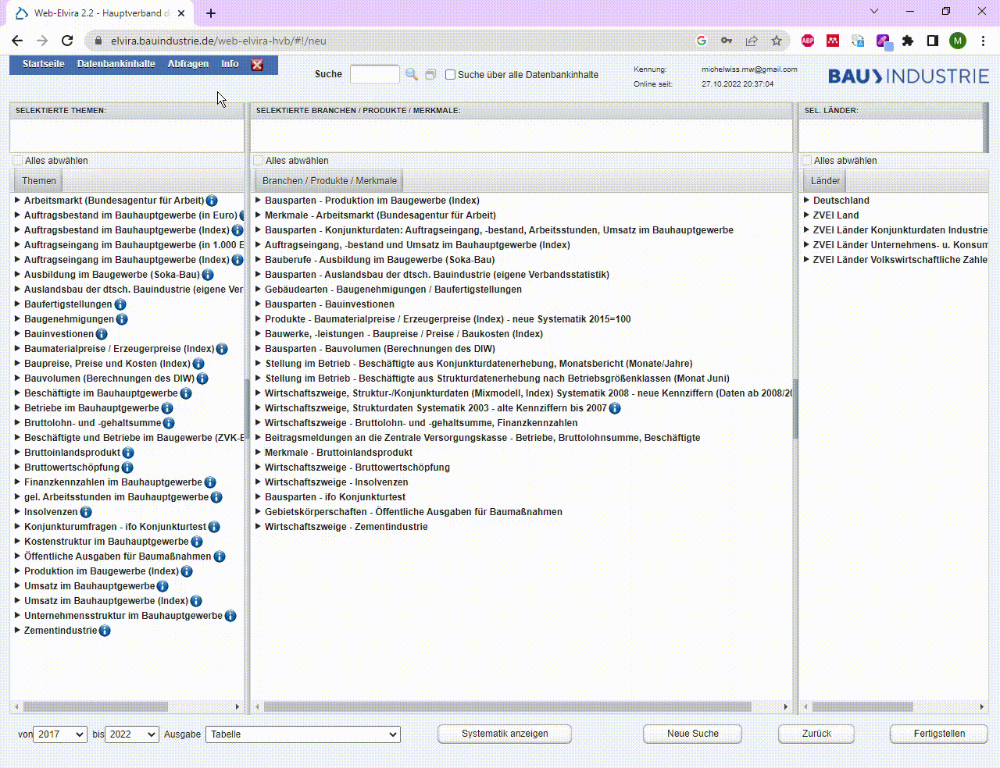

# Einleitung
## Problemstellung des Projekts
Die Erstellung von Konjunktur-, Struktur- und Marktanalysen sind für Bauunternehmen Grundlage für wichtige Unternehmensentscheidungen, betreffend Einkauf, über Investitionen und Projekte. Viele Kennzahlen in diesen Bereichen werden schon öffentlich erfasst und von den Unternehmen auch abgefragt. Die Interpretation und Darstellung gestalteten sich allerdings, vor allem über viele Quellen hinweg, bisher schwierig.
So auch beim Hauptverband der deutschen Bauindustrie, dem Kooperationspartner dieses Projekts. Dieser erstellt bisher händisch Berichte zu aktuellen Zahlen und Fakten aus der Bauindustrie. Zum Beispiel zur Baukonjunktur, zur Bauwirtschaft oder zum Arbeitsmarkt. Die Zielgruppe sind dabei Manager deutscher Bauunternehmen & die Mitglieder des Verbandes. 
An diese werden Berichte, zum einen unregelmäßig, in Form eines E-Mail Newsletters und zum anderen regelmäßig, in Form von Präsentationen auf der eigenen Homepage veröffentlicht. Zu bemerken ist hierbei, dass die Homepage nicht vom Verband, sondern einer Agentur verwaltet wird und der Verband keine Möglichkeit hat, selbst Dokumente zu veröffentlichen.
Das Erstellen der Berichte stellt dementsprechend aktuell einen hohen manuellen Aufwand dar, da sich die Daten mühsam aus der eigenen ELVIRA-Datenbank zusammengeklickt werden müssen.

 

Außerdem sind diese Berichte nicht dynamisch anpassbar. Das bedeutet für deren Empfänger, dass Daten unter Umständen nicht in den Kontext gesetzt werden können, wie es zur Erkenntnisgewinnung nötig wäre.

## Ziel des Projekts
Aufgrund der im vorherigen Absatz beschriebenen Probleme haben wir mit dem Bauverband folgendes Ziel für unser Projekt festgelegt:
Die Entwicklung eines Dashboards für Baustatistiken aus verschiedenen Blickwinkeln. 
Außerdem haben wir Rahmenbedingen und Kriterien definiert, welche in diesem Projekt realisiert wurden, um das Ziel zu erreichen:

- Möglichkeit zur flexiblen Einbindung unterschiedlichster Datenquellen, jedoch mindestens der ELVIRA-Datenbank des Verbandes
- Möglichkeit zum schnellen & einfachen Zugriff auf eingebundenen Daten
- Möglichkeit zur dynamischen Anpassung des Dashboards
- Möglichkeit zur Erstellung von Zeitreihen Prognosen, auf Basis der eingebundenen Daten
- Möglichkeit zur Veröffentlichung von Seiten durch Administratoren

## Starten der Applikation
Unser Softwaresystem wird aktuell über Github verwaltet und setzt auf eine Microservicearchitektur. Aufgrund dieser Architekturentscheidung, setzten wir zudem auf eine Containerisierung der Module. Dies geschieht durch den Einsatz von Docker. Aus diesen Gründen ergeben sich die nachfolgenden notwendigen Schritte, um die Applikation zu starten.

### **Voraussetzungen**

Für die Ausführung des Programmes ist es notwendig, Dockerdesktop (bzw. Docker) zu installieren. Der Link zur Anwendung: [_https://www.docker.com/products/docker-desktop/_](https://www.docker.com/products/docker-desktop/).

### **Download des Projekts**

1. Clonen des Repositories:    
    - `git clone https://github.com/just1130/DashboardBauindustrieDeutschland.git`
    - Im Ordner 'DashboardBauindustrieDeutschland' ist eine .env Datei abgelegt, hier können das PW und die E-Mail für die Elvira hinterlegt werden (optional).
    - Der Scraper läuft jede Nacht um 01:00 Uhr UTC, das System läuft zunächst mit Initialdaten (siehe unten).
    - Für die Zugangsdaten des Scrapers bitten wir euch, sich an das Projektteam zu wenden.

### **Start des Systems**
2. 'End of Linesequence' anpassen (optional je nach Git Einstellungen):
    - In Ordner 'forecast_and_scraping' navigieren.
    - Die Datei 'start.sh' öffnen.
    - Über den Status Balken die 'End of Linesequence' auf **'LF'** einstellen.    
    
3. Per Terminal in den Ordner **DashboardBauindustrieDeutschland** navigieren:
    - hier liegt eine Docker-Compose Datei.
    - Im Terminal folgenden Befehl eingeben: `docker-compose up --build`

4. Der Prozess wird gestartet und kann je nach System bis zu **10 Minuten** in Anspruch nehmen.    
6. Nachdem alle Server gestartet wurden, kann über die folgende URL der Prozess für eine **initiale Beladung** gestartet werden: [_http://localhost:8000/loadInitData_](http://localhost:8000/loadInitData)
    - Durch den Aufruf der Route werden initiale Daten geladen, verarbeitet und Prognosemodelle für diese abgelegt (Dauer circa eine Std.).
    - Der Prozess kann im Hintergrund weiterlaufen und das System kann sofort genutzt werden.
    - Falls die Systemleistung nicht ausreichend ist, kann das 'forecast and scraping' Modul neugestartet werden, um den Prozess abzubrechen.

### **Nutzung des Systems**

- Das Userinterface ist über die folgende URL erreichbar: [_http://localhost:3001_](http://localhost:3001).
- Beim ersten Start des Systems wird ein default User angelegt, mit dem man sich beim erstmaligem [Login](https://dashboard-dokumentation.readthedocs.io/en/latest/handbuch/#login-logout) anmelden kann.
    - E-Mail: admin@bauverband.de
    - Password: admin
    - Der Nutzer kann nach dem ersten Login [gelöscht](https://dashboard-dokumentation.readthedocs.io/en/latest/handbuch/#user-administration) werden und durch einen neuen Nutzer ersetzt werden (Siehe Handbuch).
